# Installing Raspberry Pi OS Lite + Openbox on a Raspberry Pi

## Prep
1. Format SD card using [SD Card Formatter](https://www.sdcard.org/downloads/formatter/)
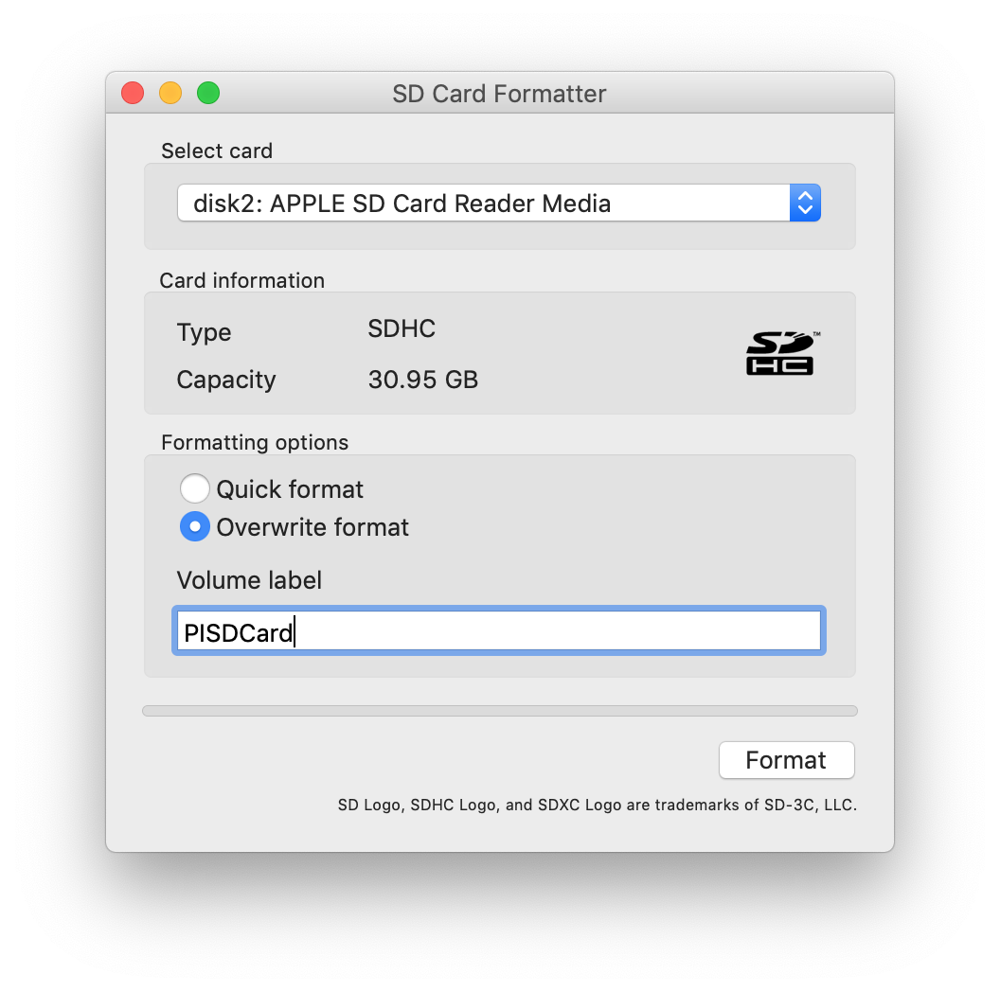

2. Burn image to SD Card using [balenaEtcher](https://www.balena.io/etcher/)
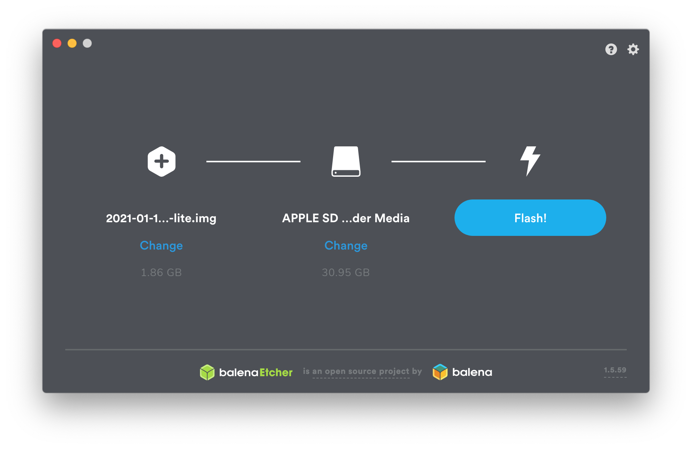

3. Create and copy `wpa_supplicant.conf` and `ssh` files to SD (usually called `boot` after flash)
  - ssh file is just an empty file titled "ssh". Create thusly:
    `$: touch ssh`
  - wpa_supplicant.conf is a file with:

  ```
  # Update your country
  country=GB
  ctrl_interface=DIR=/var/run/wpa_supplicant GROUP=netdev
  update_config=1

  # Put your network name in the ssid (in the quotes), and the
  # password in the psk (in the quotes).
  network={
      ssid=""
      psk=""
  }
  ```

  - There are copies of both of these files in the repo if you need
    [wpa_supplicant.conf](wpa_supplicant.conf)
    [ssh](ssh)

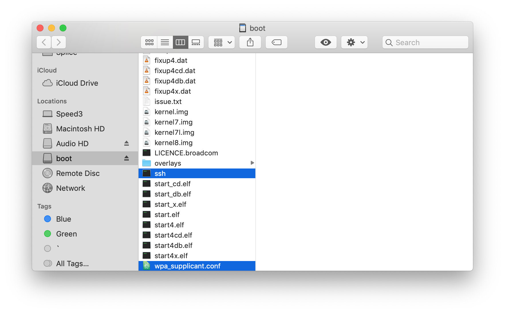

4. Insert the SD card into the Pi and power on.

5. If you don't have a monitor & keyboard & mouse set up, you need to ssh into the Pi
  - Give it a few minutes or so to run its initial boot process.
  - Check your router (Or whatever tools you use) to find the IP address of your Pi
  - (Mac) Open a Terminal and ssh into the Pi
    `$: ssh pi@192.168.X.X`
    (replacing the Xs with the appropriate numbers)
  - The default password is `raspberry` (We'll change this later)
  - On Windows you need to use Putty to ssh into a linux system. It's been a hot minute since i used Putty so look it up yourself.

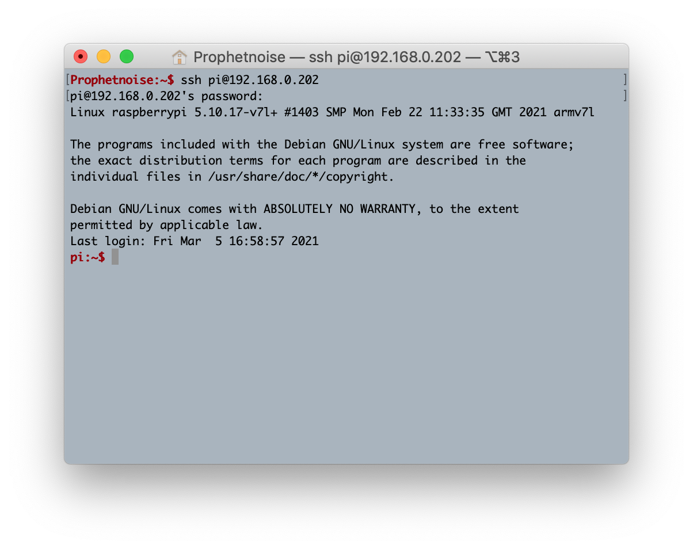

6. Expand the file system to full SD card:
  `$: sudo raspi-config`
  - Advanced Options...
  - Expand File System
  - OK
  - Finish (The Pi will reboot)
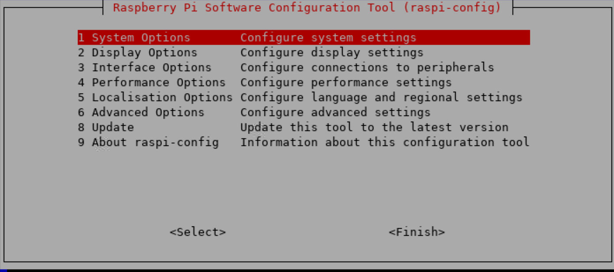
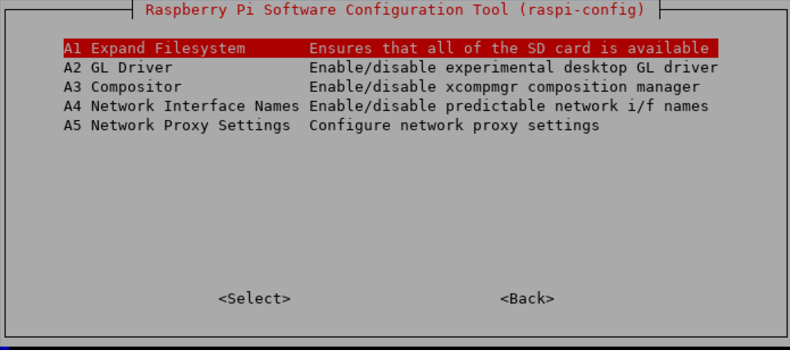

7. Update System
  - When rebooted, ssh in and update the system:
  `$: sudo apt update && sudo apt upgrade && sudo apt autoclean`

8. Update localizations:
  `$: sudo raspi-config`
  - Localization Options...
  - Set Local, Timezone, Keyboard and WLAN
  - Finish > Reboot
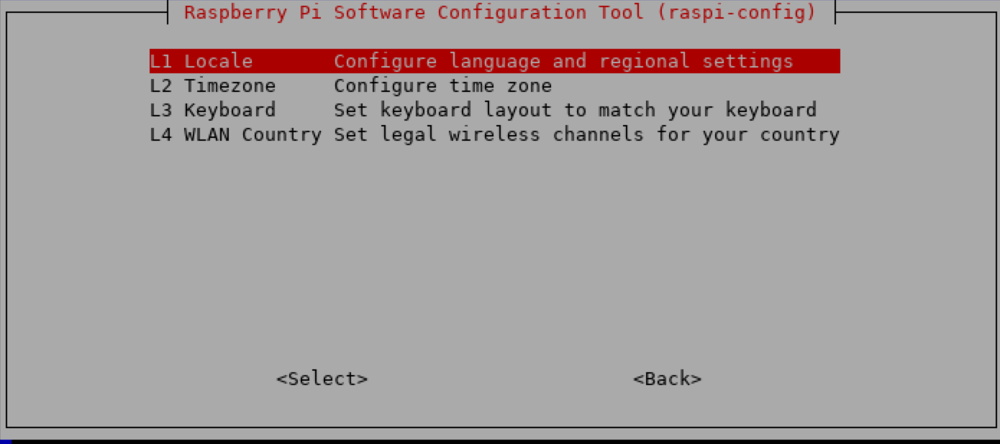

9. Install Xorg
  - When rebooted, ssh in and install Xorg:
    `$: sudo apt install xserver-Xorg`

10. Install Openbox and terminal
  `$: sudo apt install openbox lxterminal`

11. Install login manager to automatically start Openbox and log you in
  `$: sudo apt install lightdm`

12. Finish Setting up Pi
  - Change admin password
    $: sudo raspi-config
    - System Options...
    - Password
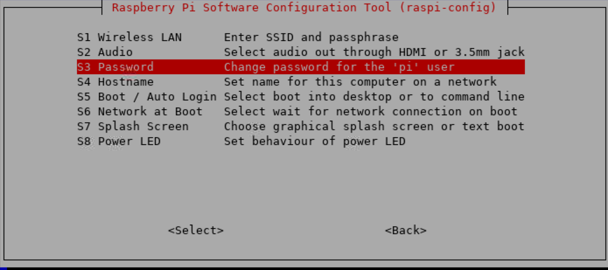

  - Boot into openbox
    `$: sudo raspi-config` (if not still in the config)
    - System Options...
    - Boot / Auto Login...
    - Desktop Autologin
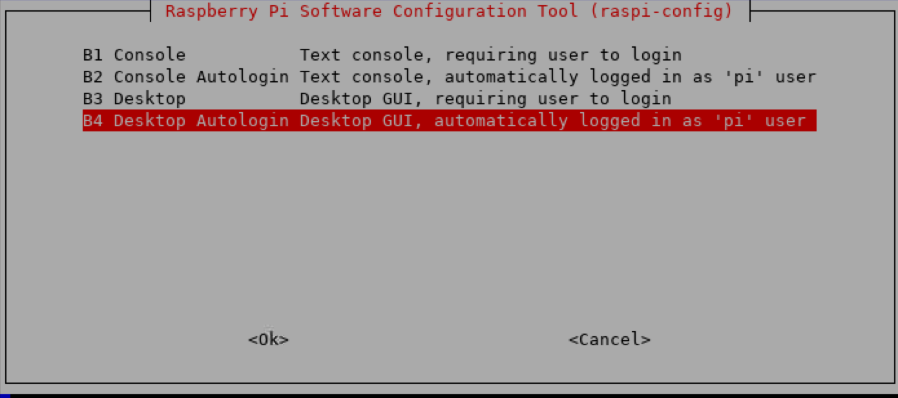

  - Turn on VNC
    - `$: sudo raspi-config` (if not still in the config)
    - Interface Options...
    - VNC...
    - Yes (Will install tons of dependencies and turn on VNC)
    - *Don't install `vnc-server` via `apt`. Using `raspi-config` installs all the extra dependencies and actually works.)*
  - Reboot
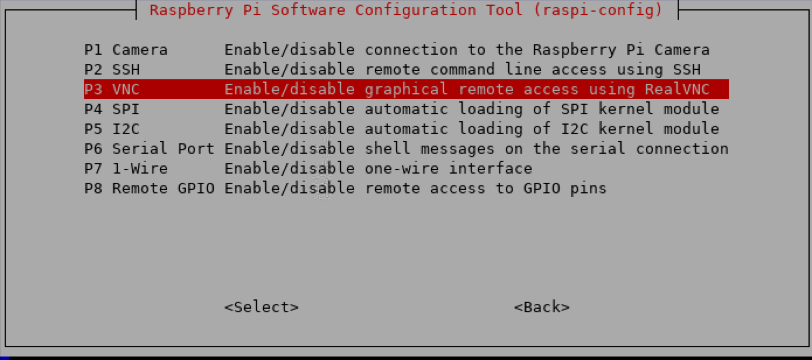

## Pi should now boot right into the empty Openbox system.

*If VNC cannot show desktop do step 13, otherwise carry on to 14*

13. Update the `config.txt`
  `$: sudo nano /boot/config.txt`
  - uncomment and update to:
    - `hdmi_force_hotplug=1`
    - `hdmi_group=2`
    - `hdmi_mode=85`
    - `dtparam=i2c_arm=on`
    - `dtparam=spi=on`
  - Add the following under the [all] section
    - `enable_uart=1`
    - `start_x=1`
    - `gpu_mem=128`
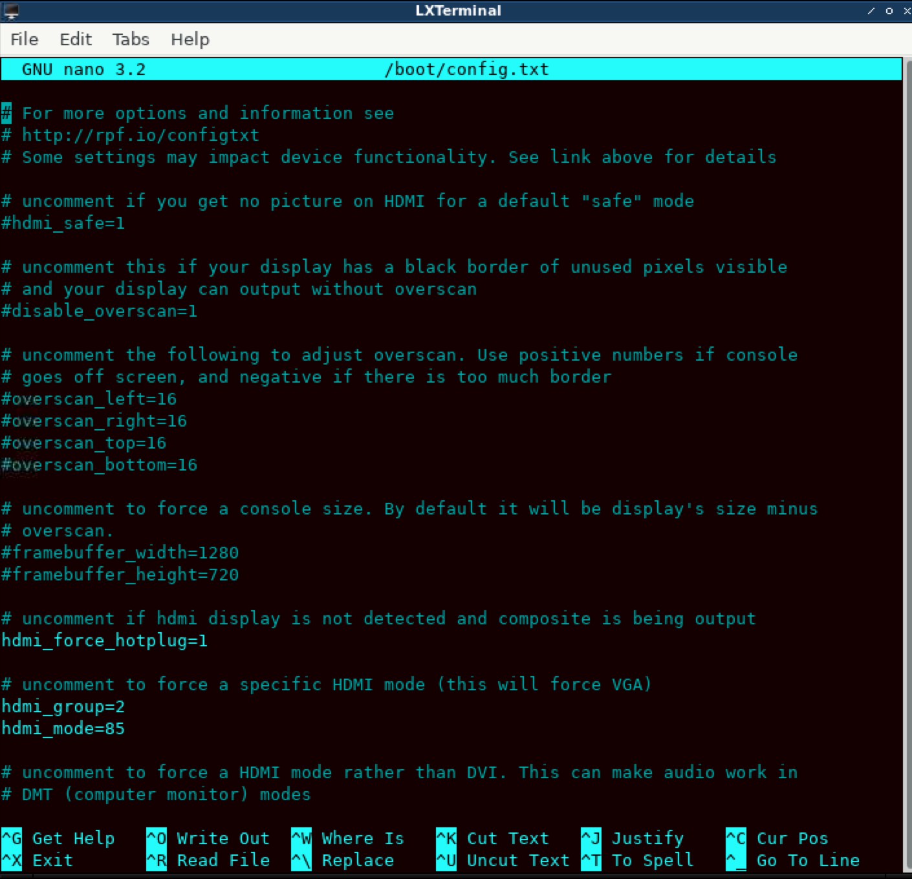

14. Update `.bashrc`
  - If you have things you like in your `.bashrc`, update them now
  - You can do this later if you want to use copy/paste
    - (You need to install a clipboard manager to copy/paste)
  - Here are mine if they interest you:
    - Comment out existing prompt code
    - At the bottom of the file, add the lines available in
      [this gist on my Github](https://gist.github.com/RFullum/d29c675b0e1c99f5df4aff069a9ff5af)
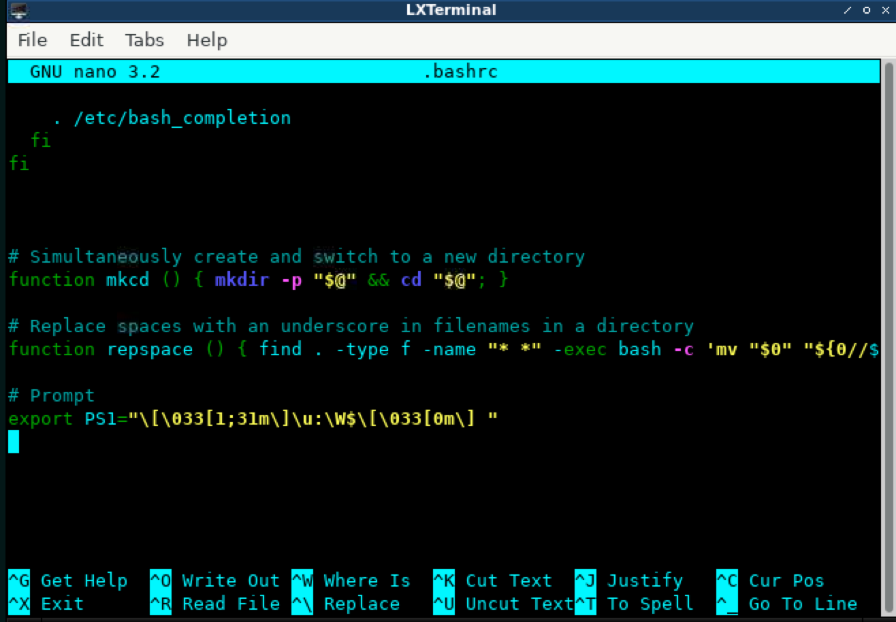

15. Set up Openbox Configuration
  - Right-click for menu
  - click ObConf (should be in right-click menu)
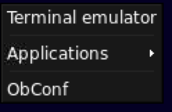
  - Theme: Nightmare-02 (Or whatever you like)
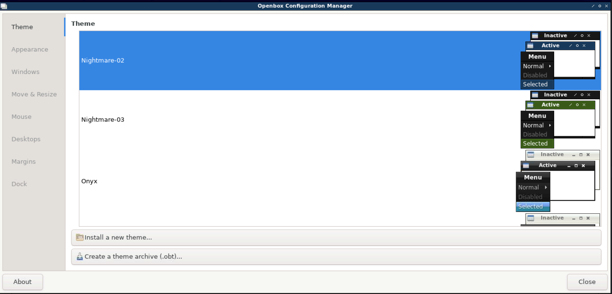
  - Appearance:
    - Active window title:   DejaVu Sans Bold 8
    - Inactive window title: DejaVu Sans Bold 8
    - Menu header:           DejaVu Sans Bold 9
    - Menu Item:             DejaVu Sans Book 9
    - Active On-screen disp: DejaVu Sans Bold 9
    - Inactive On-Screen di: DejaVu Sans Bold 9
    - Or whatever you like
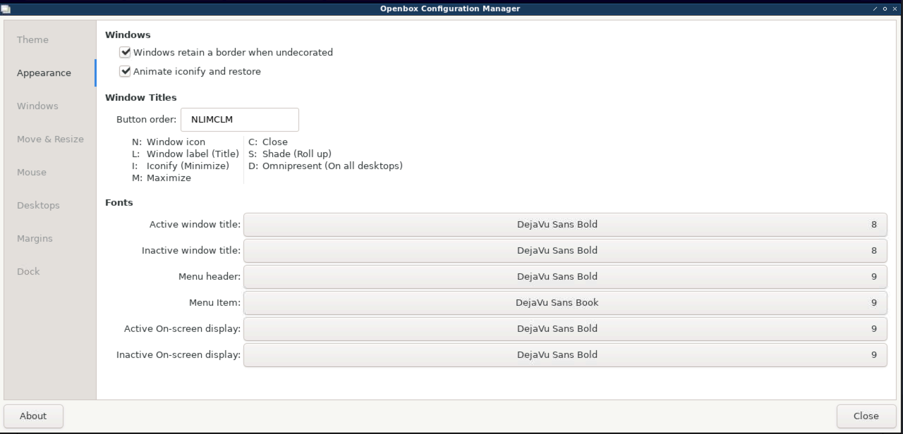
  - Desktops
    - Number of desktops: 1 (Or however many you want. I like one)
    - Rename it
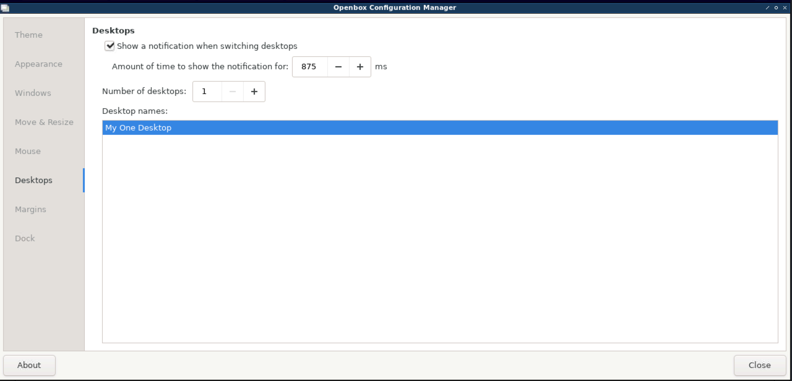
  - Close

16. Install obmenu and set up menu
```
  $: sudo apt install obmenu
  $: obmenu
```
  - Openbox 3
    - Terminal emulator
    - /Debian Menu
    - separator
    - Applications
    - separator
    - ObConf
  - Save & Close
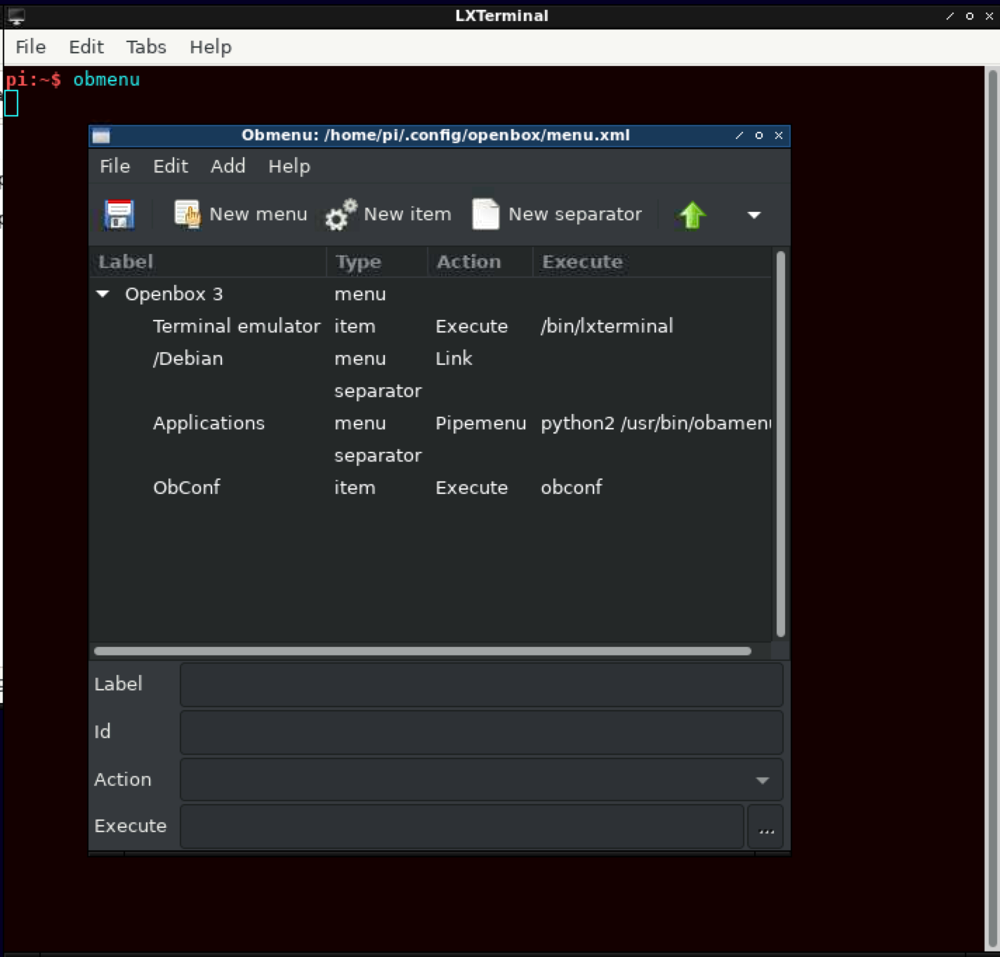

17. Install some things:
  - Install a file manager (one, the other, or both):
    `$: sudo apt install thunar`
      or
    `$: sudo apt install pcmanfm`
  - Install a clipboard app:
    `$: sudo apt install parcellite`
  - Install feh for wallpaper/background color (if you use Thunar)
    `$: sudo apt install feh`
  - Install Tint2 (panel app)
    `$: sudo apt install tint2`

18. Create and update openbox autostart script
  - Change directories to the .config directory
    `$: cd .config`
  - If `openbox` directory doesn't exist, make it
    `$: mkdir openbox`
  - create `autostart.sh` file in openbox directory
    `$: touch autostart.sh`
  - The autostart script should exist here now:
    `~/.config/openbox/autostart.sh`
  - edit to add items to autostart.sh
    `$: nano autostart.sh`

```
      # Autostart installed apps in Openbox

      # File Manager (if Thunar) + run in background and automount drives
      thunar --daemon &

      # File Manager (if pcmanfm) + run in background and automount drives
      pcmanfm --desktop &

      # Clipboard Manager
      exec parcellite &

      # Panel
      (sleep 1 && tint2) &

      # Wallpaper
```

  - (We will add the wallpaper command to `autostart.sh` later. We need this preliminary setup to get the VNC file transfer working, and other things like copy/paste)

19. Reboot
  `$: sudo reboot now`
  - It should reboot into an openbox with a default panel, and the things you set up in the `autostart.sh` script
  - If you used `pcmanfm`, right-click the desktop, and under Advanced select "Show menus provided by window manager menu when desktop is clicked." This will bring back the Openbox Right-click menu.
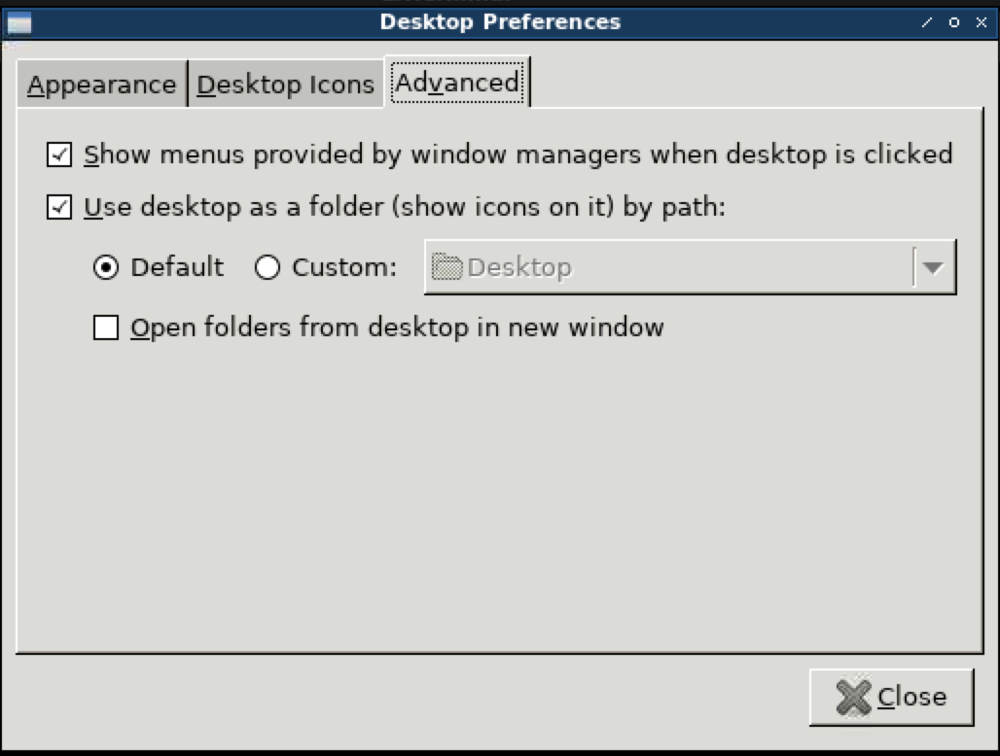
  - If you used pcmanfm, feel free to remove trash from desktop because i don't want anything on my desktop.

20. Set up Tint2
  - transfer `noise_TransparentPanel_top.tint2rc` to the Pi via VNC file transfer, and import. (Or set up a new configuration)
    File: [noise_TransparentPanel_top.tint2rc](noise_TransparentPanel_top.tint2rc)
  - Right-click menu > Applications > Settings > Tint2Settings *or* `$: tint2con`
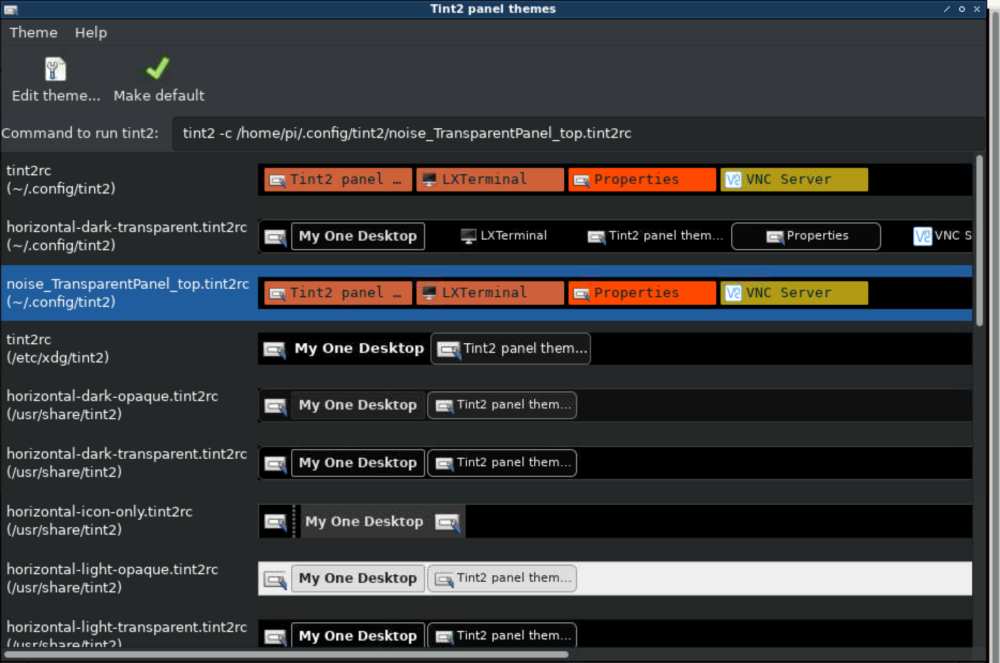
  - Import the noise_TransparentPanel_top.tint2rc file into Tint2
    - Theme > Import theme...
    - Browse to where VNC transferred the file to (usually either `Desktop` or `Downloads`) and import it.
  - The theme should appear in the Tint2Settings manager.
    - Click on it
    - Click the `Make Default` button.
  - A copy of the `noise_TransparentPanel_top.tint2rc` is now in the `~/.config/tint2/` directory, so you can remove the one you transferred

    `$: rm Downloads/noise_TransparentPanel_top.tint2rc`
        *or*
    `$: rm Desktop/noise_TransparentPanel_top.tint2rc`

21. Fix Screen Resolution
  - Using either `raspi-config` or `/boot/config.txt`, fix any screen resolution issues you may have.
  - Play with either the `framebuffer_width` & `framebuffer_height`, or the `hdmi_mode` & `hdmi_group`. The width and height would be to directly set the resolution. The mode and group will set a standardized resolution [explained here.](https://www.raspberrypi.org/documentation/configuration/config-txt/video.md)
  - If you have those uncommented and it still refuses to give the correct screen resolution over VNC and you're on a Pi 4, in the `/boot/config.txt` comment out:
      `dtoverlay=vc4-fkms-v3d`
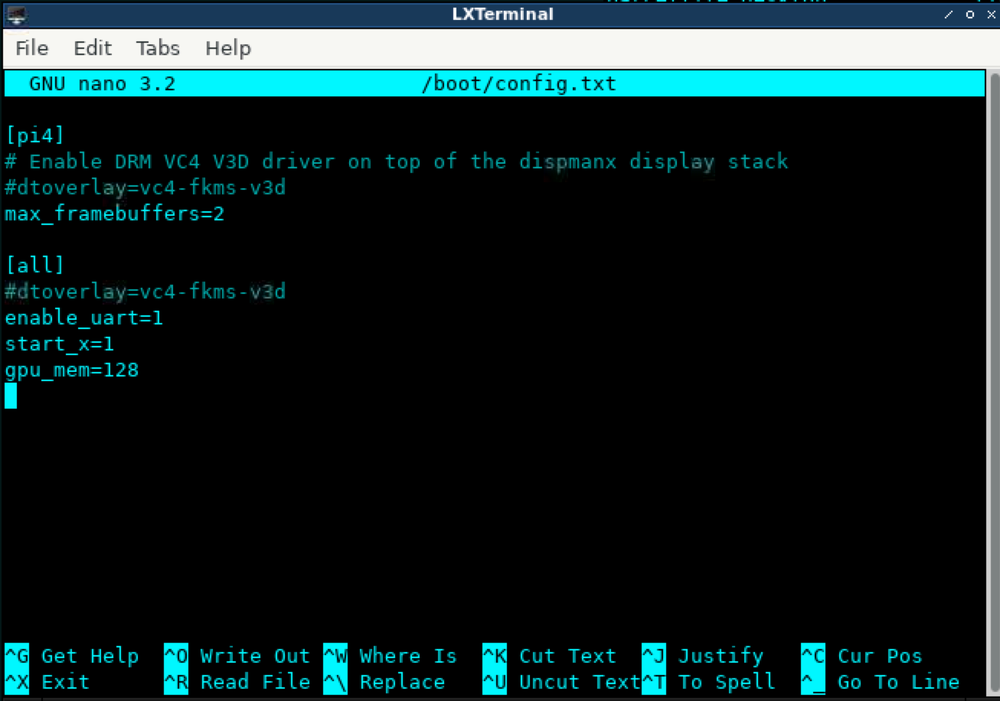

22. If you're using `Thunar`, you need to set up `feh` to run your wallpaper or background color. (`pcmanfm` manages background color and wallpaper)
  - Either transfer an image over VNC with the same resolution as your screen to the Pi, or create an image in Photoshop/Gimp/etc. with that resolution. Fill it with the background color you want. (The background color is essentially just a jpg, png, tiff, or gif of made of that color.)
  - using `feh`, open the image:
    `$: feh --bg-scale “/path/to/image.jpg”`
  - Now that you've opened the image in feh, it stores its name in a file called `.fehbg`, so you can add that to your `autostart.sh` file:
```
    $: cd .config/openbox
    $: nano autostart.sh
```
    - Add wallpaper under the comment from before:
```
      # wallpaper
      $HOME/.fehbg &
```
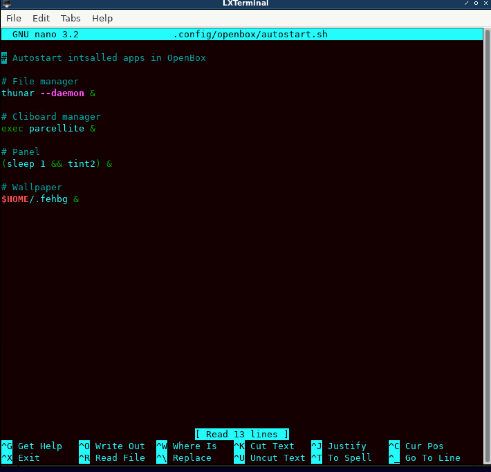
  - When you restart it will make the file store in `.fehbg` your wallpaper

23. Right-click Menu item icons and launch commands
  - Out of the box, some applications won't launch their applications and others don't have the any icons. Here's how we fix that.
  - You can find the `.desktop` files that control menu items here:
    `~/usr/share/applications/`
  - cd into that directory and run ls to see what's in there
```
    cd /usr/share/applications
    $: ls
```
    It should show a list of all the `.desktop` files for your installed applications in the Right-click Menu.
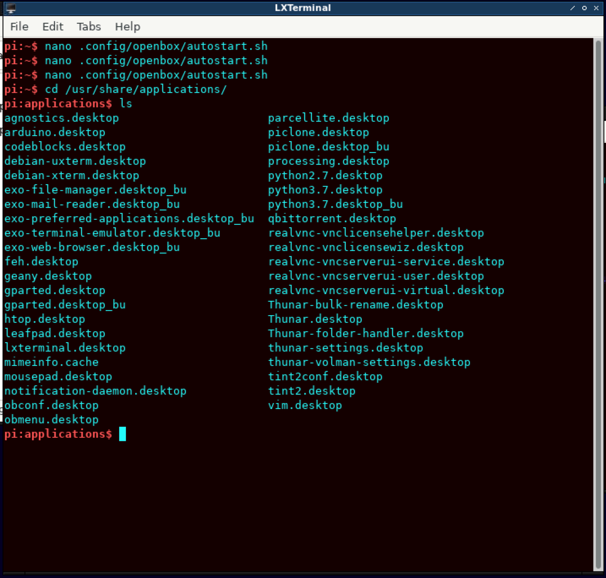
  - Right-click on the desktop and find an application without an icon
    - Suppose `LXTerminal` is missing an icon. Open its `.desktop` app:
      `$: sudo nano lxterminal.desktop`

  - Open a second terminal window
  - Search the Pi's file structure for the program's icons:
    `$: sudo find / -name appname*png`

    So, for example, if i'm looking for the `LXTerminal` icons:
    `$: sudo find / -name lxterm*png`

    It should give a bunch of results like:
```
    /usr/share/icons/PiX/48x48/apps/lxterminal.png
    /usr/share/icons/hicolor/128x128/apps/lxterminal.png
```

    Pick whichever one you see fit: highlight that line in the terminal by double-clicking the line, and then copy using `right-click > copy`
    (control-c/control-v can be a bit sketchy in VNC inside terminal)
  - In the first terminal window with the `.desktop` file open, find the
    line that starts with Icon
    - search with `control-w`
    - type "icon"
    - press enter
    - it should take you to the icon line
  - Delete what Icon is pointing to, and replace it by right-click-pasting the path to the `.png` file you copied from the other terminal window

    `Icon=lxterminal`
      becomes:
    `Icon=/usr/share/icons/hicolor/128x128/apps/lxterminal.png`

  - `control-o` saves in nano
  - `control-x` exits nano
  - Right-click and see that the application now has an icon.
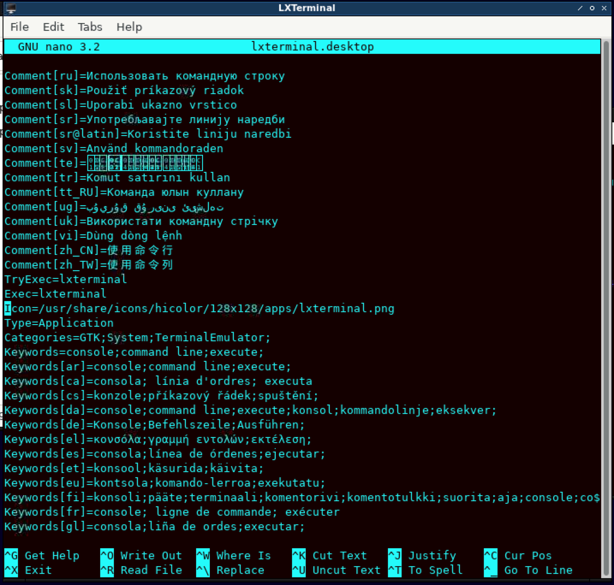


  - Go through the Right-click menu applications and try to run them. Some will not run. They'll often throw an error like:
      `Failed to execute child process "evte" (No such file or directory)`
    This happens either because it's calling the wrong command, or trying to run the command in a terminal window.
  - Open the `.desktop` file and control-w to search for "exec"
  - In a second terminal window, try running the command. If the program runs, you know the `.desktop` file has the right command, so the problem isn't the `Exec=` line.
  - Look for a line like:
      `Terminal=true`
    This is trying to run the program in a terminal window. But, for some reason Openbox on the Pi doesn't like this. Instead, change it to `false`, and run both terminal and the program in the `Exec` line. I'll use HTop as an example:
```
      Terminal=true
      Exec=htop
```
    Replace with:
```
      Terminal=false
      Exec=lxterminal -e "bash -c 'htop;$SHELL'"
```
  - `control-o` to save
  - `control-x` to exit
  - Right-click menu, and try running the application from the menu.
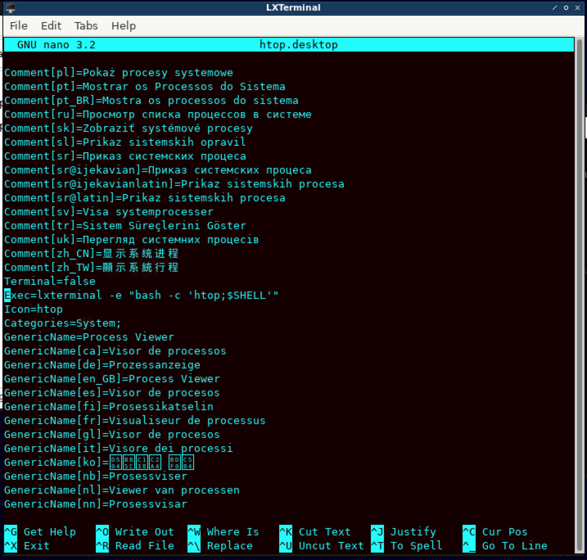
  - For applications like Python3, you can either set it up in the same manner to run the python interpreter in a new terminal window, or another option would be to install a Python text editor like `Geany` using `$: sudo apt instal geany`, and then change the `Exec=`
    from:
      `Exec=PythonXXX`
    To:
      `Exec=Geany`
    Because, you want to use the editor to write python scripts, not just run python.

24. Create a backup image
  - Using the `dd` piped to `gzip` commands, we can create a backup image of your pi.
  - This image can be flashed to another SD card using something like `balenaEtcher` in the exact same way you flashed it with the Raspberry Pi OS Lite image, except this will be an exact bit-for-bit duplicate of your full running system. That means a few things:
    - The image will be zipped so it will save space, but will be the full size when unzipped, so you can only flash it on an SD card the exact same size or larger (but no larger than 32GB unless you do a bunch of special shit i'm not getting into.)
    - The image can be put directly back into the same exact Pi, boot, and fully function without any setup.
    - The image can be put in the exact same type of Pi (3a+ to 3a+, 4B to 4B, ZeroW to ZeroW, etc.) and *should* boot and run without any setup or issues, but it might not 100% of the time. Most issues you'd run into with this would be if there have been hardware or firmware differences between your "exact same" Pis
    - It won't run on different versions of RasPi (No... 3a+ to 3b+ probably won't work)
  - Insert (and mount if it doesn't automount) a USB stick with enough space to hold the image. (If you installed `Thunar` or `pcmanfm` and added them to the `autostart.sh` with the `--daemon` or `--desktop` options respectively, the filemanger's daemon should run in the background and automount USB sticks. I find with `Thunar` i have to open an instance of `Thunar`, put in the USB Stick, and then click on the USB stick's name once it appears in `Thunar` to get it to actually automount.)
  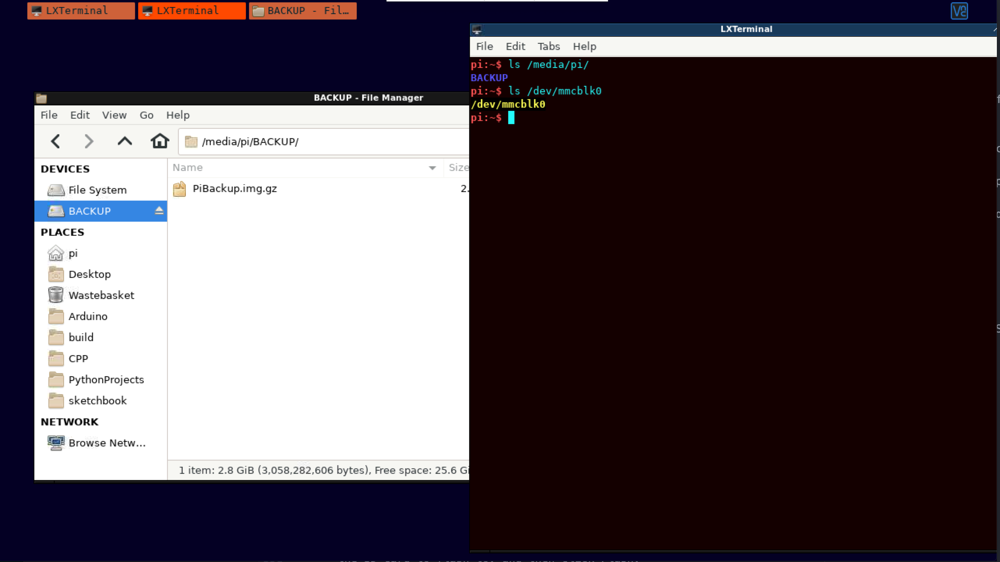
    - I fit a 32GB SD card with RasPiOS Lite + OpenBox + very little extra installed as a 3.5GB zipped image. But, err on the side of having enough space on your USB Stick.
    - Pis usually mount to `/media/pi/USBDriveName`, but double check where your USB Stick is mounted
    - Pis usually have the SD Card as `/dev/mmcblk0`, but double check to make sure yours is too. (Either install and check `gparted`, or google for the commands that will tell you)
  - To backup run the command:
    `$: sudo dd bs=4M if=/dev/mmcblk0 | gzip > /media/pi/USBDriveName/backupFileName.img.gz`
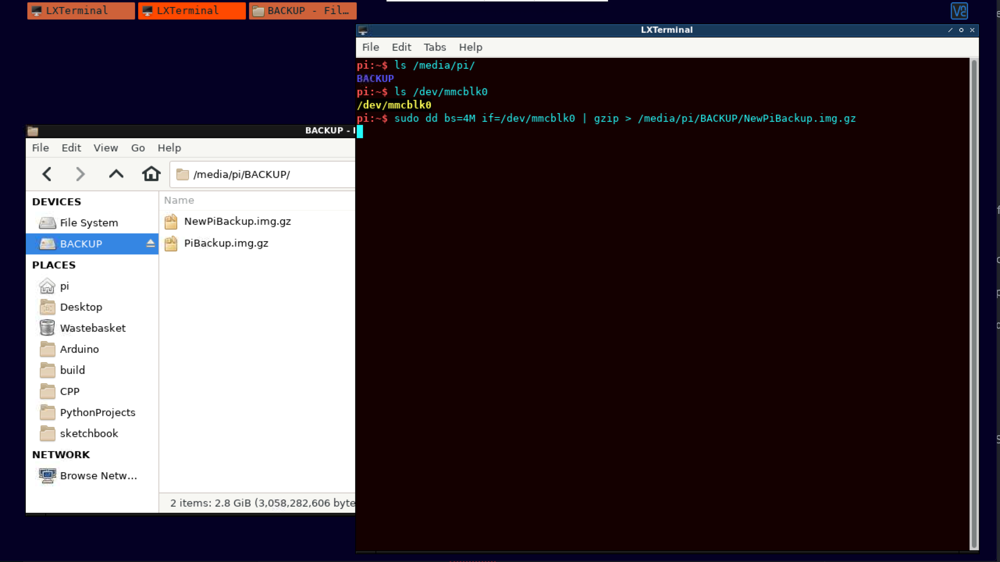
  - This will take a while. You'll know it's done because your terminal's prompt will return.

  - To restore an SD Card from the backup
    - Insert SD Card and format it using SD Card Formatter (*just like you did in step 1*)
    - Insert the USB drive with the backup into a USB port
    - Using `balenaEtcher`, select the image from the USB Drive, select the SD Card to flash to, and then click Flash. (*just like you did in step 2*)
    - Once complete, just drop it in your Pi and boot

25. From here it's just installing your preferred applications and playing with your Pi.

## Really useful links:
- Guide to setting up [Raspbian Lite with choice of RPD/LXDE/XFCE/MATE/i3/Openbox/X11 GUI](https://taillieu.info/index.php/internet-of-things/raspberrypi/389-raspbian-lite-with-rpd-lxde-xfce-mate-i3-openbox-x11-gui)
- Urukama's [OpenBox Guide](https://urukrama.wordpress.com/openbox-guide/)
- Debian's [Openbox Wiki Guide](https://wiki.debian.org/Openbox)
- Don't Call Me Lenny's [Openbox Setup Video](https://www.youtube.com/watch?v=aXzB_BHjQHk)
- Arch Linux's [PCManFM Wiki Guide](https://wiki.archlinux.org/index.php/PCManFM) *remember Arch is a different Linux environment from Debian (Raspberry Pi OS) so some things might be different*
- Raspberry Pi's [Backup with DD](https://www.raspberrypi.org/documentation/linux/filesystem/backup.md)
- Raspberry Pi's [Video options](https://www.raspberrypi.org/documentation/configuration/config-txt/video.md)
- Raspberry Pi OS [downloads](https://www.raspberrypi.org/software/operating-systems/#raspberry-pi-os-32-bit)
- Raspberry Pi's [forums](https://www.raspberrypi.org/forums/)
- My [Github](https://github.com/RFullum) (programs and scripts)
- My [Github Gists](https://gist.github.com/RFullum) (Useful and fun scripts)
