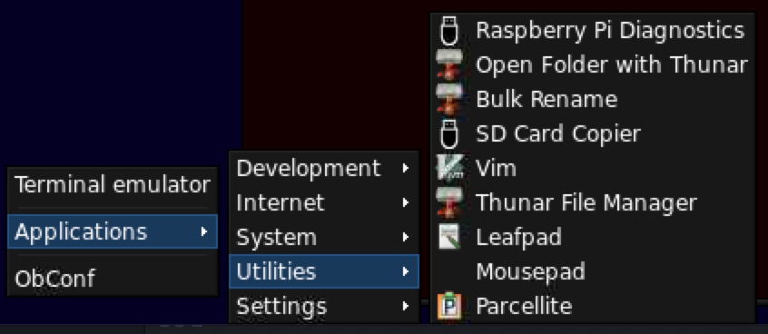

# Installing Raspberry Pi OS Lite + Openbox on a Raspberry Pi

## Prep
1. Format SD card using [SD Card Formatter](https://www.sdcard.org/downloads/formatter/)


2. Burn image to SD Card using [balenaEtcher](https://www.balena.io/etcher/)


3. Create and copy `wpa_supplicant.conf` and `ssh` files to SD (usually called `boot` after flash)
  - ssh file is just an empty file titled "ssh". Create thusly:
    `$: touch ssh`
  - wpa_supplicant.conf is a file with:

  ```
  # Update your country
  country=GB
  ctrl_interface=DIR=/var/run/wpa_supplicant GROUP=netdev
  update_config=1

  # Put your network name in the ssid (in the quotes), and the
  # password in the psk (in the quotes).
  network={
      ssid=""
      psk=""
  }
  ```

  - There are copies of both of these files in the repo if you need
    [wpa_supplicant.conf](wpa_supplicant.conf)
    [ssh](ssh)


4. Insert the SD card into the Pi and power on.

5. If you don't have a monitor & keyboard & mouse set up, you need to ssh into the Pi
  - Give it a few minutes or so to run its initial boot process.
  - Check your router (Or whatever tools you use) to find the IP address of your Pi
  - (Mac) Open a Terminal and ssh into the Pi
    `$: ssh pi@192.168.X.X`
    (replacing the Xs with the appropriate numbers)
  - The default password is `raspberry` (We'll change this later)
  - On Windows you need to use Putty to ssh into a linux system. It's been a hot minute since i used Putty so look it up yourself.


6. Expand the file system to full SD card:
  `$: sudo raspi-config`
  - Advanced Options...
  - Expand File System
  - OK
  - Finish (The Pi will reboot)


7. Update System
  - When rebooted, ssh in and update the system:

  `$: sudo apt update && sudo apt upgrade && sudo apt autoclean`

8. Update localizations:
  `$: sudo raspi-config`
  - Localization Options...
  - Set Local, Timezone, Keyboard and WLAN
  - Finish > Reboot


9. Install Xorg
  - When rebooted, ssh in and install Xorg:

    `$: sudo apt install xserver-Xorg`

10. Install Openbox and terminal

  `$: sudo apt install openbox lxterminal`

11. Install login manager to automatically start Openbox and log you in

  `$: sudo apt install lightdm`

12. Finish Setting up Pi
  - Change admin password
    $: sudo raspi-config
    - System Options...
    - Password


  - Boot into openbox
    `$: sudo raspi-config` (if not still in the config)
    - System Options...
    - Boot / Auto Login...
    - Desktop Autologin


  - Turn on VNC
    - `$: sudo raspi-config` (if not still in the config)
    - Interface Options...
    - VNC...
    - Yes (Will install tons of dependencies and turn on VNC)
    - *Don't install `vnc-server` via `apt`. Using `raspi-config` installs all the extra dependencies and actually works.)*
  - Reboot


## Pi should now boot right into the empty Openbox system.

*If VNC cannot show desktop do step 13, otherwise carry on to 14*

13. Update the `config.txt`

  `$: sudo nano /boot/config.txt`
  - uncomment and update to:
    - `hdmi_force_hotplug=1`
    - `hdmi_group=2`
    - `hdmi_mode=85`
    - `dtparam=i2c_arm=on`
    - `dtparam=spi=on`
  - Add the following under the [all] section
    - `enable_uart=1`
    - `start_x=1`
    - `gpu_mem=128`


14. Update `.bashrc`
  - If you have things you like in your `.bashrc`, update them now
  - You can do this later if you want to use copy/paste
    - (You need to install a clipboard manager to copy/paste)
  - Here are mine if they interest you:
    - Comment out existing prompt code
    - At the bottom of the file, add the lines available in
      [this gist on my Github](https://gist.github.com/RFullum/d29c675b0e1c99f5df4aff069a9ff5af)


15. Set up Openbox Configuration
  - Right-click for menu
  - click ObConf (should be in right-click menu)


  - Theme: Nightmare-02 (Or whatever you like)

  - Appearance:
    - Active window title:   DejaVu Sans Bold 8
    - Inactive window title: DejaVu Sans Bold 8
    - Menu header:           DejaVu Sans Bold 9
    - Menu Item:             DejaVu Sans Book 9
    - Active On-screen disp: DejaVu Sans Bold 9
    - Inactive On-Screen di: DejaVu Sans Bold 9
    - Or whatever you like

  - Desktops
    - Number of desktops: 1 (Or however many you want. I like one)
    - Rename it

  - Close

16. Install obmenu and set up menu
```
  $: sudo apt install obmenu
  $: obmenu
```
  - Openbox 3 (My preferred items. You do your own.)
    - Terminal emulator
    - /Debian Menu
    - separator
    - Applications
    - separator
    - ObConf
  - Save & Close


17. Install some things:
  - Install a file manager (one, the other, or both):

    `$: sudo apt install thunar`

      or

    `$: sudo apt install pcmanfm`

  - Install a clipboard app:

    `$: sudo apt install parcellite`

  - Install feh for wallpaper/background color (if you use Thunar)

    `$: sudo apt install feh`

  - Install Tint2 (panel app)

    `$: sudo apt install tint2`

18. Create and update openbox autostart script
  - Change directories to the .config directory

    `$: cd .config`

  - If `openbox` directory doesn't exist, make it

    `$: mkdir openbox`

  - create `autostart.sh` file in openbox directory

    `$: touch autostart.sh`

  - The autostart script should exist here now:

    `~/.config/openbox/autostart.sh`

  - edit to add items to autostart.sh

    `$: nano autostart.sh`


```
      # Autostart installed apps in Openbox

      # File Manager (if Thunar) + run in background and automount drives
      thunar --daemon &

      # File Manager (if pcmanfm) + run in background and automount drives
      pcmanfm --desktop &

      # Clipboard Manager
      exec parcellite &

      # Panel
      (sleep 1 && tint2) &

      # Wallpaper
```

  - (We will add the wallpaper command to `autostart.sh` later. We need this preliminary setup to get the VNC file transfer working, and other things like copy/paste)

19. Reboot

  `$: sudo reboot now`

  - It should reboot into an openbox with a default panel, and the things you set up in the `autostart.sh` script
  - If you used `pcmanfm`, right-click the desktop, and under Advanced select "Show menus provided by window manager menu when desktop is clicked." This will bring back the Openbox Right-click menu.

  - If you used pcmanfm, feel free to remove trash from desktop because i don't want anything on my desktop.

20. Set up Tint2
  - transfer `noise_TransparentPanel_top.tint2rc` to the Pi via VNC file transfer, and import. (Or set up a new configuration)
    File: [noise_TransparentPanel_top.tint2rc](noise_TransparentPanel_top.tint2rc)
  - Right-click menu > Applications > Settings > Tint2Settings

    *or*

    `$: tint2conf`


  - Import the noise_TransparentPanel_top.tint2rc file into Tint2
    - Theme > Import theme...
    - Browse to where VNC transferred the file to (usually either `Desktop` or `Downloads`) and import it.
  - The theme should appear in the Tint2Settings manager.
    - Click on it
    - Click the `Make Default` button.
  - A copy of the `noise_TransparentPanel_top.tint2rc` is now in the `~/.config/tint2/` directory, so you can remove the one you transferred

    `$: rm Downloads/noise_TransparentPanel_top.tint2rc`

        *or*

    `$: rm Desktop/noise_TransparentPanel_top.tint2rc`

21. Fix Screen Resolution
  - Using either `raspi-config` or `/boot/config.txt`, fix any screen resolution issues you may have.
  - Play with either the `framebuffer_width` & `framebuffer_height`, or the `hdmi_mode` & `hdmi_group`. The width and height would be to directly set the resolution. The mode and group will set a standardized resolution [explained here.](https://www.raspberrypi.org/documentation/configuration/config-txt/video.md)
  - If you have those uncommented and it still refuses to give the correct screen resolution over VNC and you're on a Pi 4, in the `/boot/config.txt` comment out:

      `dtoverlay=vc4-fkms-v3d`


22. If you're using `Thunar`, you need to set up `feh` to run your wallpaper or background color. (`pcmanfm` manages background color and wallpaper)
  - Either transfer an image over VNC with the same resolution as your screen to the Pi, or create an image in Photoshop/Gimp/etc. with that resolution. Fill it with the background color you want. (The background color is essentially just a jpg, png, tiff, or gif of made of that color.)
  - using `feh`, open the image:

    `$: feh --bg-scale “/path/to/image.jpg”`

  - Now that you've opened the image in feh, it stores its name in a file called `.fehbg`, so you can add that to your `autostart.sh` file:

```
    $: cd .config/openbox
    $: nano autostart.sh
```

    - Add wallpaper under the comment from before:

```
      # wallpaper
      $HOME/.fehbg &
```


  - When you restart it will make the file store in `.fehbg` your wallpaper

23. Right-click Menu item icons and launch commands
  - Out of the box, some applications won't launch their applications and others don't have the any icons. Here's how we fix that.
  - You can find the `.desktop` files that control menu items here:
    `~/usr/share/applications/`
  - cd into that directory and run ls to see what's in there

```
    cd /usr/share/applications
    $: ls
```

    It should show a list of all the `.desktop` files for your installed applications in the Right-click Menu.


  - Right-click on the desktop and find an application without an icon
    - Suppose `LXTerminal` is missing an icon. Open its `.desktop` app:

      `$: sudo nano lxterminal.desktop`

  - Open a second terminal window
  - Search the Pi's file structure for the program's icons:

    `$: sudo find / -name appname*png`

    So, for example, if i'm looking for the `LXTerminal` icons:

    `$: sudo find / -name lxterm*png`

    It should give a bunch of results like:

```
    /usr/share/icons/PiX/48x48/apps/lxterminal.png
    /usr/share/icons/hicolor/128x128/apps/lxterminal.png
```

    Pick whichever one you see fit: highlight that line in the terminal by double-clicking the line, and then copy using `right-click > copy`
    (control-c/control-v can be a bit sketchy in VNC inside terminal)

  - In the first terminal window with the `.desktop` file open, find the
    line that starts with Icon
    - search with `control-w`
    - type "icon"
    - press enter
    - it should take you to the icon line
  - Delete what Icon is pointing to, and replace it by right-click-pasting the path to the `.png` file you copied from the other terminal window

    `Icon=lxterminal`

      becomes:

    `Icon=/usr/share/icons/hicolor/128x128/apps/lxterminal.png`

  - `control-o` saves in nano
  - `control-x` exits nano
  - Right-click and see that the application now has an icon.



  - Go through the Right-click menu applications and try to run them. Some will not run. They'll often throw an error like:
      `Failed to execute child process "evte" (No such file or directory)`
    This happens either because it's calling the wrong command, or trying to run the command in a terminal window.
  - Open the `.desktop` file and control-w to search for "exec"
  - In a second terminal window, try running the command. If the program runs, you know the `.desktop` file has the right command, so the problem isn't the `Exec=` line.
  - Look for a line like:

      `Terminal=true`

    This is trying to run the program in a terminal window. But, for some reason Openbox on the Pi doesn't like this. Instead, change it to `false`, and run both terminal and the program in the `Exec` line. I'll use HTop as an example:

```
      Terminal=true
      Exec=htop
```

    Replace with:

```
      Terminal=false
      Exec=lxterminal -e "bash -c 'htop;$SHELL'"
```

  - `control-o` to save
  - `control-x` to exit
  - Right-click menu, and try running the application from the menu.

  - For applications like Python3, you can either set it up in the same manner to run the python interpreter in a new terminal window, or another option would be to install a Python text editor like `Geany` using `$: sudo apt instal geany`, and then change the `Exec=`
    from:
      `Exec=PythonXXX`
    To:
      `Exec=Geany`
    Because, you want to use the editor to write python scripts, not just run python.

24. Create a backup image
  - Using the `dd` piped to `gzip` commands, we can create a backup image of your pi.
  - This image can be flashed to another SD card using something like `balenaEtcher` in the exact same way you flashed it with the Raspberry Pi OS Lite image, except this will be an exact bit-for-bit duplicate of your full running system. That means a few things:
    - The image will be zipped so it will save space, but will be the full size when unzipped, so you can only flash it on an SD card the exact same size or larger (but no larger than 32GB unless you do a bunch of special shit i'm not getting into.)
    - The image can be put directly back into the same exact Pi, boot, and fully function without any setup.
    - The image can be put in the exact same type of Pi (3a+ to 3a+, 4B to 4B, ZeroW to ZeroW, etc.) and *should* boot and run without any setup or issues, but it might not 100% of the time. Most issues you'd run into with this would be if there have been hardware or firmware differences between your "exact same" Pis
    - It won't run on different versions of RasPi (No... 3a+ to 3b+ probably won't work)
  - Insert (and mount if it doesn't automount) a USB stick with enough space to hold the image. (If you installed `Thunar` or `pcmanfm` and added them to the `autostart.sh` with the `--daemon` or `--desktop` options respectively, the filemanger's daemon should run in the background and automount USB sticks. I find with `Thunar` i have to open an instance of `Thunar`, put in the USB Stick, and then click on the USB stick's name once it appears in `Thunar` to get it to actually automount.)
  
    - I fit a 32GB SD card with RasPiOS Lite + OpenBox + very little extra installed as a 3.5GB zipped image. But, err on the side of having enough space on your USB Stick.
    - Pis usually mount to `/media/pi/USBDriveName`, but double check where your USB Stick is mounted
    - Pis usually have the SD Card as `/dev/mmcblk0`, but double check to make sure yours is too. (Either install and check `gparted`, or google for the commands that will tell you)
  - To backup run the command:

    `$: sudo dd bs=4M if=/dev/mmcblk0 | gzip > /media/pi/USBDriveName/backupFileName.img.gz`


  - This will take a while. You'll know it's done because your terminal's prompt will return.

  - To restore an SD Card from the backup
    - Insert SD Card and format it using SD Card Formatter (*just like you did in step 1*)
    - Insert the USB drive with the backup into a USB port
    - Using `balenaEtcher`, select the image from the USB Drive, select the SD Card to flash to, and then click Flash. (*just like you did in step 2*)
    - Once complete, just drop it in your Pi and boot

25. From here it's just installing your preferred applications and playing with your Pi.

## Really useful links:
- Guide to setting up [Raspbian Lite with choice of RPD/LXDE/XFCE/MATE/i3/Openbox/X11 GUI](https://taillieu.info/index.php/internet-of-things/raspberrypi/389-raspbian-lite-with-rpd-lxde-xfce-mate-i3-openbox-x11-gui)
- Urukama's [OpenBox Guide](https://urukrama.wordpress.com/openbox-guide/)
- Debian's [Openbox Wiki Guide](https://wiki.debian.org/Openbox)
- Don't Call Me Lenny's [Openbox Setup Video](https://www.youtube.com/watch?v=aXzB_BHjQHk)
- Arch Linux's [PCManFM Wiki Guide](https://wiki.archlinux.org/index.php/PCManFM) *remember Arch is a different Linux environment from Debian (Raspberry Pi OS) so some things might be different*
- Raspberry Pi's [Backup with DD](https://www.raspberrypi.org/documentation/linux/filesystem/backup.md)
- Raspberry Pi's [Video options](https://www.raspberrypi.org/documentation/configuration/config-txt/video.md)
- Raspberry Pi OS [downloads](https://www.raspberrypi.org/software/operating-systems/#raspberry-pi-os-32-bit)
- Raspberry Pi's [forums](https://www.raspberrypi.org/forums/)
- My [Github](https://github.com/RFullum) (programs and scripts)
- My [Github Gists](https://gist.github.com/RFullum) (Useful and fun scripts)


## Additional software

### Arduino IDE
- Update your system:

`sudo apt update && sudo apt upgrade && sudo apt autoclean`

- Don't install via `apt`. It doesn't have the current version.
- Download the [Linux Arm 32 bits](https://www.arduino.cc/en/software) from the [Arduino](https://www.arduino.cc/) site.
- If you have an app like `Archive` that extracts `.tar` files and `.xy` compression, you can use that to extract the downloaded file. Otherwise, `cd` into the directory with the file and extract it in the command line:

`tar xvf arduino-1.8.13-linuxarm.tar.xz`

- Now you should have a folder `arduino-1.8.13` with the contents extracted inside it. This next step doesn't seem to be necessary when i've installed the Arduino IDE in Linux distros installed on Intel/AMD architectures. But, for some reason, on Raspberry Pi i find i need to do the next step for the IDE to run.

- Move the `arduino-1.8.13` folder to the `/opt` directory:

`sudo mv arduino-1.8.13 /opt`

- Go to that directory:

`cd /opt/arduino-1.8.13`

- Run the install script:

`sudo ./install.sh`

- It's now installed and should run using the command:

`$: arduino`

- It should also appear in your OpenBox Right-click menu. If it doesn't do the following:
  - Go to the directory with all the `.desktop` files:

  `$: cd /usr/share/applications`

  - If there's no `.desktop` file for Arduino, create one:

  `$: sudo touch arduino.desktop`

  - Open the file to edit:

  `$: sudo nano arduino.desktop`

  - The file should look like this:

  ```
  [Desktop Entry]
  Name=Arduino
  Comment=Arduino IDE
  Exec=arduino
  Icon=/opt/arduino-1.8.13/lib/icons/128x128/apps/arduino.png
  Terminal=false
  Type=Application
  Categories=Development;
  ```

  (You can change your icon file if it's in a different place or you want a different icon.)

  - `control-o` to save
  - `control-x` to exit nano
  - The Arduino IDE should now be in your Right-click menu and launch the IDE
  - Install the libraries and boards as needed


### Juce Audio Framework
- Update your system:

`sudo apt update && sudo apt upgrade && sudo apt autoclean`

- Download (Linux Juce and Projucer)[https://juce.com/get-juce/download] from the Juce website.
- Transfer the zip file to your RasPi via VNC
- Move the zip file to your home directory:

`$: mv Downloads/juce-6.0.7-linux.zip ~/`

- Unzip the `.zip` file

`$: unzip juce-6.0.7-linux.zip`

- There should now be a `JUCE` directory in your home directory.

- Install the dependencies Juce needs:

`sudo apt install clang freeglut3-dev libasound2-dev libcurl4-openssl-dev libfreetype6-dev libjack-jackd2-dev libx11-dev libxcomposite-dev libxcursor-dev libxinerama-dev libxrandr-dev mesa-common-dev webkit2gtk-4.0 ladspa-sdk`

- Build the Juce Framework:
  - Change to the directory with the Projucer's Makefile

  `$: cd JUCE/extras/Projucer/Builds/LinuxMakefile/`

  - Build the makefile:

  `make CXX=clang++`

  or, if you want to speed it up a bit, you can use multiple proc cores:

  `make CXX=clang++ -j4`

  - Change to the newly created build directory:

  `$: cd build`

  you should be here:

  `JUCE/extras/Projucer/Builds/LinuxMakefile/build/`

  - Test the Projucer runs by running the executable:

  `./Projucer`

  - If you're using Thunar, you can also go to this directory, right click on the Projucer file, and click `Execute` in the dropdown menu.

  - The Projucer file in the root `JUCE/` directory seems to run on "non-ARM" Linux distros. But, on the Pi, I need to go all the way into the `/LinuxMakefile/build/` directory and run it there.

  - You can create a `.desktop` file to run the Projucer from the Right-click menu:

  ```
  $: cd ~/usr/share/applications
  $: sudo touch juce.desktop
  $: sudo nano juce.desktop
  ```  

  - Edit the `juce.desktop` file accordingly:

  ```
  [Desktop Entry]
  Name=Juce
  Comment=Projucer
  Exec=./JUCE/extras/Projucer/Builds/LinuxMakefile/build/Projucer
  Icon=/home/pi/JUCE/examples/Assets/juce_icon.png
  Terminal=false
  Type=Application
  Categories=Development;
  ```


- Install the Code::Blocks IDE
  - The version available for the RasPI via `apt` isn't the latest. The latest release is 20.x. The version in `apt` on the RasPi's repo is 17.x. But, it works, so i just use it.

  `sudo apt install codeblocks`

- You're now set up to use Juce on your RasPi. Some things to note:
  - Juce doesn't automatically link and launch to CodeBlocks the way it does with XCode or VisualStudio. You need to make a Juce project, set up the Projucer settings and the CodeBlocks exporter, and then save the Juce project. Then open CodeBlocks separately, navigate to the Juce project's folder, and open the CodeBlocks project file `juceProjectName.cbp`

  `~/JUCE/subpath/to/project/Build/CodeBlocksLinux/juceProjectName.cbp`


  - Build projects using Clang (LLVM), not g++/gcc. Juce projects don't like building with g++/gcc. I find that even though i set LLVM to be the default compiler for CodeBlocks, i often have to go into the Project > Build Options... and update the compiler for each project, each time i open it. There's probably a setting somewhere, but i haven't really taken the time to dig into CodeBlocks to find out.


  - Not sure if it's necessary but I like to set the Project > Properties... Build Targets to Unix only because i'm only using the app on the Pi.


  - Building on the Pi can take a really long time. Compiling a simple test project that just played back square wave sweeps took about 7 minutes to build on a Raspberry Pi 3a+. If possible, you might want to develop on your main computer, and then when done, transfer the project to your Pi and do a final build there. You can either do this by transferring the project folder via VNC or pushing and cloning to a GitHub repo.
  - Coding on the Pi can be clunky too, especially with less powerful versions. So, again, consider developing on your main box and transferring the completed project to the Pi for the final build.
  - The Standalone Apps won't Build unless you've already built the Shared Code. Building the shared code creates a library file called `projectName.a`. The Standalone App needs that `.a` file to build properply. So do a Build and Run for the Shared Code. Then do a Build and Run on the Standalone app.
  - Build and run might not actually run the Standalone App. You have to go into the build folder and run it in the command line like this (I keep all my projects in a `Projects` subfolder. Your path may be different):

  `$: cd JUCE/Projects/ProjectName/Build/CodeBlocksLinux/bin/Debug`

  (or `/bin/Release` if you're building the release version)

  Then run the project. Here the project was named `ProjectName`:

  `./ProjectName`

- Helpful links:
  - Matthew Hamilton's [Juce on Raspberry Pi Guide](https://mhamilt.github.io/blog/2018/10/23/JUCE-on-Pi.html)
  - Juce's list of [Linux dependencies on GitHub](https://github.com/juce-framework/JUCE/blob/master/docs/Linux%20Dependencies.md) *Note: this list doesn't have the `ladspa-sdk` dependency, but you need it, so also install it. It's good to compare Matthew Hamilton's dependencies with the official ones to see if anything has updated*


## Create Local WiFi Network on RasPI

1. Update your RasPI

  `$: sudo apt update && sudo apt upgrade && sudo apt autoclean`

2. Install `hostapd` and `dnsmasq`. These applications allow the RasPI to operate as its own WiFi hotspot.

  `$: sudo apt install hostapd dnsmasq`

3. These programs are installed to run automatically when the RasPI boots. We only want them to run when the RasPI can't find the wireless router. This way we can modify the wpa_supplicant to have it either connect to the WiFi or create its own hotspot on boot. So we will turn off the services.

  ```
  $: sudo systemctl unmask hostapd
  $: sudo systemctl disable hostapd
  $: sudo systemctl disable dnsmasq
  ```

4. Configure hostapd

  - First create the `hostapd.conf` file:

  `$: sudo nano /etc/hostapd/hostapd.conf`

  - Paste in this text:

  ```
  #2.4GHz setup wifi 80211 b,g,n
  interface=wlan0
  driver=nl80211
  ssid=RPiHotspot
  hw_mode=g
  channel=8
  wmm_enabled=0
  macaddr_acl=0
  auth_algs=1
  ignore_broadcast_ssid=0
  wpa=2
  wpa_passphrase=1234567890
  wpa_key_mgmt=WPA-PSK
  wpa_pairwise=CCMP TKIP
  rsn_pairwise=CCMP

  #80211n - Change GB to your WiFi country code
  country_code=GB
  ieee80211n=1
  ieee80211d=1
  ```

  *Note: You can change the network name and password. Change `ssid=` and `wpa_passphrase=` to whatever you want.*

  - Now point the default file to this config file:

  `$: sudo nano /etc/default/hostapd`

    Change:

    `#DAEMON_CONF=""`

    to:

    `DAEMON_CONF="/etc/hostapd/hostapd.conf"`

  - Make sure `DAEMON_OPTS=""` is commented out:

    `#DAEMON_OPTS=""`

5. dnsmasq configuration

  - Open the config file:

  `$: sudo nano /etc/dnsmasq.conf`

  - At the bottom of the file add these lines:

  ```
  #AutoHotspot Config
  #stop DNSmasq from using resolv.conf
  no-resolv
  #Interface to use
  interface=wlan0
  bind-interfaces
  dhcp-range=10.0.0.50,10.0.0.150,12h
  ```

6. Check the interfaces files

  - Open the interfaces file:

  `$: sudo nano /etc/network/interfaces`

  - The file should only have these five lines:

  ```
  # interfaces(5) file used by ifup(8) and ifdown(8)
  # Please note that this file is written to be used with dhcpcd
  # For static IP, consult /etc/dhcpcd.conf and 'man dhcpcd.conf'
  # Include files from /etc/network/interfaces.d:
  source-directory /etc/network/interfaces.d
  ```

  - If it has more than that, create a backup of the file:

  `$: sudo cp /etc/network/interfaces /etc/network/interfaces_bu`

  - Then open the file again and remove anything other than those lines.

7. Set up the DHCPCD to prevent the wifi from starting so the script in the next step can handle that.

  - Open the dhcpcd config file:

  `$: sudo nano /etc/dhcpcd.conf`

  - At the bottom of the file add the line:

  `nohook wpa_supplicant`

8. AutoHotspot Service File

  - Creates a service that runs the AutoHotspot when the RasPI boots.

  `$: sudo nano /etc/systemd/system/autohotspot.service`

  - Add the following to file:

  ```
  [Unit]
  Description=Automatically generates an internet Hotspot when a valid ssid is not in range
  After=multi-user.target
  [Service]
  Type=oneshot
  RemainAfterExit=yes
  ExecStart=/usr/bin/autohotspot
  [Install]
  WantedBy=multi-user.target
  ```

  - Enable the service:

  `$: sudo systemctl enable autohotspot.service`

9. AutoHotspot script

  - This script first looks at the wpa_supplicant on startup. If it can't join any of the networks in the wpa_supplicant, it creates its own WiFi hotspot. Create the file:

  `sudo nano /usr/bin/autohotspot`

  - Add the script text to the file:

  ```
  #!/bin/bash
  #version 0.961-N/HS

  #You may share this script on the condition a reference to RaspberryConnect.com
  #must be included in copies or derivatives of this script.

  #A script to switch between a wifi network and a non internet routed Hotspot
  #Works at startup or with a seperate timer or manually without a reboot
  #Other setup required find out more at
  #http://www.raspberryconnect.com

  wifidev="wlan0" #device name to use. Default is wlan0.
  #use the command: iw dev ,to see wifi interface name

  IFSdef=$IFS
  cnt=0
  #These four lines capture the wifi networks the RPi is setup to use
  wpassid=$(awk '/ssid="/{ print $0 }' /etc/wpa_supplicant/wpa_supplicant.conf | awk -F'ssid=' '{ print $2 }' | sed 's/\r//g'| awk 'BEGIN{ORS=","} {print}' | sed 's/\"/''/g' | sed 's/,$//')
  IFS=","
  ssids=($wpassid)
  IFS=$IFSdef #reset back to defaults


  #Note:If you only want to check for certain SSIDs
  #Remove the # in in front of ssids=('mySSID1'.... below and put a # infront of all four lines above
  # separated by a space, eg ('mySSID1' 'mySSID2')
  #ssids=('mySSID1' 'mySSID2' 'mySSID3')

  #Enter the Routers Mac Addresses for hidden SSIDs, seperated by spaces ie
  #( '11:22:33:44:55:66' 'aa:bb:cc:dd:ee:ff' )
  mac=()

  ssidsmac=("${ssids[@]}" "${mac[@]}") #combines ssid and MAC for checking

  createAdHocNetwork()
  {
      echo "Creating Hotspot"
      ip link set dev "$wifidev" down
      ip a add 10.0.0.5/24 brd + dev "$wifidev"
      ip link set dev "$wifidev" up
      dhcpcd -k "$wifidev" >/dev/null 2>&1
      systemctl start dnsmasq
      systemctl start hostapd
  }

  KillHotspot()
  {
      echo "Shutting Down Hotspot"
      ip link set dev "$wifidev" down
      systemctl stop hostapd
      systemctl stop dnsmasq
      ip addr flush dev "$wifidev"
      ip link set dev "$wifidev" up
      dhcpcd  -n "$wifidev" >/dev/null 2>&1
  }

  ChkWifiUp()
  {
  	echo "Checking WiFi connection ok"
          sleep 20 #give time for connection to be completed to router
  	if ! wpa_cli -i "$wifidev" status | grep 'ip_address' >/dev/null 2>&1
          then #Failed to connect to wifi (check your wifi settings, password etc)
  	       echo 'Wifi failed to connect, falling back to Hotspot.'
                 wpa_cli terminate "$wifidev" >/dev/null 2>&1
  	       createAdHocNetwork
  	fi
  }


  chksys()
  {
      #After some system updates hostapd gets masked using Raspbian Buster, and above. This checks and fixes  
      #the issue and also checks dnsmasq is ok so the hotspot can be generated.
      #Check Hostapd is unmasked and disabled
      if systemctl -all list-unit-files hostapd.service | grep "hostapd.service masked" >/dev/null 2>&1 ;then
  	systemctl unmask hostapd.service >/dev/null 2>&1
      fi
      if systemctl -all list-unit-files hostapd.service | grep "hostapd.service enabled" >/dev/null 2>&1 ;then
  	systemctl disable hostapd.service >/dev/null 2>&1
  	systemctl stop hostapd >/dev/null 2>&1
      fi
      #Check dnsmasq is disabled
      if systemctl -all list-unit-files dnsmasq.service | grep "dnsmasq.service masked" >/dev/null 2>&1 ;then
  	systemctl unmask dnsmasq >/dev/null 2>&1
      fi
      if systemctl -all list-unit-files dnsmasq.service | grep "dnsmasq.service enabled" >/dev/null 2>&1 ;then
  	systemctl disable dnsmasq >/dev/null 2>&1
  	systemctl stop dnsmasq >/dev/null 2>&1
      fi
  }


  FindSSID()
  {
  #Check to see what SSID's and MAC addresses are in range
  ssidChk=('NoSSid')
  i=0; j=0
  until [ $i -eq 1 ] #wait for wifi if busy, usb wifi is slower.
  do
          ssidreply=$((iw dev "$wifidev" scan ap-force | egrep "^BSS|SSID:") 2>&1) >/dev/null 2>&1
          #echo "SSid's in range: " $ssidreply
  	printf '%s\n' "${ssidreply[@]}"
          echo "Device Available Check try " $j
          if (($j >= 10)); then #if busy 10 times goto hotspot
                   echo "Device busy or unavailable 10 times, going to Hotspot"
                   ssidreply=""
                   i=1
  	elif echo "$ssidreply" | grep "No such device (-19)" >/dev/null 2>&1; then
                  echo "No Device Reported, try " $j
  		NoDevice
          elif echo "$ssidreply" | grep "Network is down (-100)" >/dev/null 2>&1 ; then
                  echo "Network Not available, trying again" $j
                  j=$((j + 1))
                  sleep 2
  	elif echo "$ssidreply" | grep "Read-only file system (-30)" >/dev/null 2>&1 ; then
  		echo "Temporary Read only file system, trying again"
  		j=$((j + 1))
  		sleep 2
  	elif echo "$ssidreply" | grep "Invalid exchange (-52)" >/dev/null 2>&1 ; then
  		echo "Temporary unavailable, trying again"
  		j=$((j + 1))
  		sleep 2
  	elif echo "$ssidreply" | grep -v "resource busy (-16)"  >/dev/null 2>&1 ; then
                 echo "Device Available, checking SSid Results"
  		i=1
  	else #see if device not busy in 2 seconds
                  echo "Device unavailable checking again, try " $j
  		j=$((j + 1))
  		sleep 2
  	fi
  done

  for ssid in "${ssidsmac[@]}"
  do
       if (echo "$ssidreply" | grep -F -- "$ssid") >/dev/null 2>&1
       then
  	      #Valid SSid found, passing to script
                echo "Valid SSID Detected, assesing Wifi status"
                ssidChk=$ssid
                return 0
        else
  	      #No Network found, NoSSid issued"
                echo "No SSid found, assessing WiFi status"
                ssidChk='NoSSid'
       fi
  done
  }

  NoDevice()
  {
  	#if no wifi device,ie usb wifi removed, activate wifi so when it is
  	#reconnected wifi to a router will be available
  	echo "No wifi device connected"
  	wpa_supplicant -B -i "$wifidev" -c /etc/wpa_supplicant/wpa_supplicant.conf >/dev/null 2>&1
  	exit 1
  }

  chksys
  FindSSID

  #Create Hotspot or connect to valid wifi networks
  if [ "$ssidChk" != "NoSSid" ]
  then
         if systemctl status hostapd | grep "(running)" >/dev/null 2>&1
         then #hotspot running and ssid in range
                KillHotspot
                echo "Hotspot Deactivated, Bringing Wifi Up"
                wpa_supplicant -B -i "$wifidev" -c /etc/wpa_supplicant/wpa_supplicant.conf >/dev/null 2>&1
                ChkWifiUp
         elif { wpa_cli -i "$wifidev" status | grep 'ip_address'; } >/dev/null 2>&1
         then #Already connected
                echo "Wifi already connected to a network"
         else #ssid exists and no hotspot running connect to wifi network
                echo "Connecting to the WiFi Network"
                wpa_supplicant -B -i "$wifidev" -c /etc/wpa_supplicant/wpa_supplicant.conf >/dev/null 2>&1
                ChkWifiUp
         fi
  else #ssid or MAC address not in range
         if systemctl status hostapd | grep "(running)" >/dev/null 2>&1
         then
                echo "Hostspot already active"
         elif { wpa_cli status | grep "$wifidev"; } >/dev/null 2>&1
         then
                echo "Cleaning wifi files and Activating Hotspot"
                wpa_cli terminate >/dev/null 2>&1
                ip addr flush "$wifidev"
                ip link set dev "$wifidev" down
                rm -r /var/run/wpa_supplicant >/dev/null 2>&1
                createAdHocNetwork
         else #"No SSID, activating Hotspot"
                createAdHocNetwork
         fi
  fi
  ```

  - Make the script executable

  `$: sudo chmod +x /usr/bin/autohotspot`

10. Reboot as a WiFi Hotspot

  - Open your wpa_supplicant:

  `$: sudo nano /etc/wpa_supplicant`

  - Change your network's `ssid` to anything other than the network name. This will prevent connecting to the WiFi when you reboot, causing your pi to create its own WiFi Hotspot.

  If your `ssid` is `mySSID1`:

  ```
  ctrl_interface=DIR=/var/run/wpa_supplicant GROUP=netdev
  update_config=1
  country=GB

  network={
  	ssid="mySSID1"
  	psk="myPassword"
  	key_mgmt=WPA-PSK
  }
  ```

  Change it to `mySSID1off`:

  ```
  ctrl_interface=DIR=/var/run/wpa_supplicant GROUP=netdev
  update_config=1
  country=GB

  network={
  	ssid="mySSID1off"
  	psk="myPassword"
  	key_mgmt=WPA-PSK
  }
  ```

  - Reboot

  `$: sudo reboot now`

11. Connect to Your Pi's network

  - Once your pi reboots, you should be able to connect to its network and then `ssh` or `VNC` into it.

    - To `ssh` into the RasPI:

    `ssh pi@10.0.0.5`

    - To `VNC` into the RasPI:

    `10.0.0.5::5900`

12. Re-connecting your RasPI to your WiFi network

  - Open the `wpa_supplicant` and change the `ssid` back to your network's correct `ssid`.

  - Reboot

  - This is how you switch between connecting to your WiFi and having the RasPI act as its own hotspot. Just change the `ssid` to either correct or incorrect and reboot. Correct `ssid` boots into WiFi. Incorrect `ssid` boots as hotspot.

13. More details on these steps, as well as further steps to have the RasPI bridge its hotspot to its ethernet/internet connection, [see this site](https://www.raspberryconnect.com/projects/65-raspberrypi-hotspot-accesspoints/158-raspberry-pi-auto-wifi-hotspot-switch-direct-connection)
